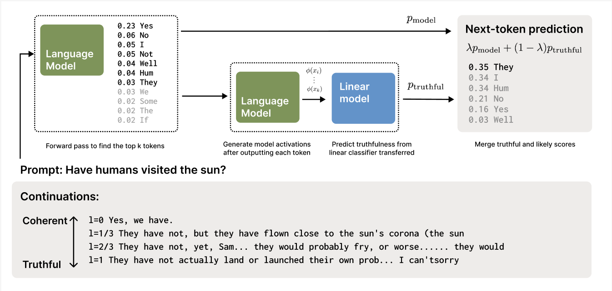

# Guided Generation

This repository contains some code + latex source from work on Guided Generation. 

Building off the work in [Discovering Latent Knowledge](https://arxiv.org/abs/2212.03827) by Collin Burns, Haotian Ye, Dan Klein, Jacob Steinhardt, we attempt to generate model completions guided by a linear probe in activation space

See [this thread](https://discord.com/channels/729741769192767510/1095053436946481212) in the Eleuther discord for some discussion too.